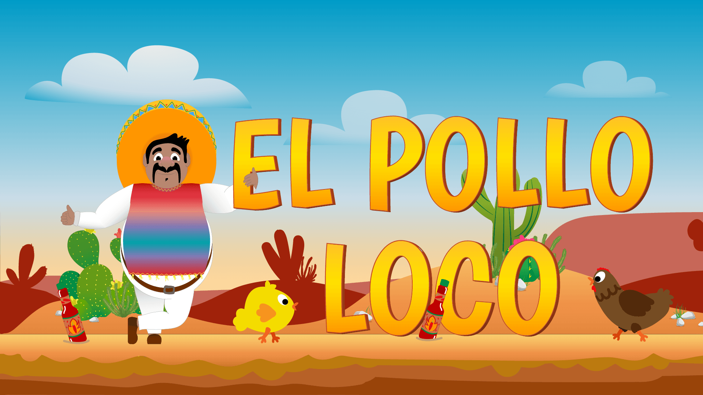

# El Pollo Loco

Ein 2D-Jump-'n'-Run im Browser — Vanilla JavaScript, HTML5 Canvas, kein Framework
und kein Build-Step.

Pepe läuft durch die mexikanische Wüste, sammelt Münzen und Tabasco-Flaschen und
schlägt sich durch Hühnerhorden bis zum Endboss: *El Pollo Loco*. Gegner lassen sich
von oben zertrampeln oder mit Flaschen abwerfen.



## Features

- Objektorientierte Engine mit der Vererbungskette `DrawableObject → MovableObject → …`
- Gegner spawnen dynamisch vor dem Spieler — mit Mindestabstand und Cap von 30 gleichzeitig
- Endboss mit eigener Angriffslogik: distanzgetriggert, läuft an, lungiert beim Angriff
- Wurfmechanik mit Rotation im Flug, Splash-Animation und Cooldown
- HUD mit Statusbars für Leben, Flaschen, Münzen und Endboss-Energie
- Zentraler SoundManager, Mute-Toggle persistiert über `localStorage`
- Touch-Steuerung per Pointer-Events und Hinweis-Overlay im Portrait-Modus
- Idle-Animationen: Pepe wird bei Inaktivität müde und schnarcht

## Spielen

```bash
git clone https://github.com/NouBou1/el_pollo_loco.git
cd el_pollo_loco
npx serve .
```

Alternativ `index.html` direkt öffnen. Start per <kbd>Enter</kbd>, Play-Button oder
Tap auf das Canvas.

## Steuerung

| Taste | Aktion |
|---|---|
| <kbd>←</kbd> <kbd>→</kbd> | Laufen |
| <kbd>↑</kbd> / <kbd>Space</kbd> | Springen |
| <kbd>D</kbd> | Flasche werfen |
| <kbd>Enter</kbd> | Starten / neu starten |

Auf Touch-Geräten gibt es dieselben Aktionen als On-Screen-Buttons. Gespielt wird
im Querformat.

## Spielwerte

| | |
|---|---|
| Pepes Energie | 100 |
| Kontaktschaden Huhn / kleines Huhn / Endboss | 10 / 5 / 7 |
| Endboss | 20 Energie, aktiviert sich ab x = 3100 |
| Level 1 | 22 Flaschen, 12 Münzen, 3595 px lang |
| Canvas | 720 × 480 px, Game-Loop mit 60 Ticks/s |

Gewonnen ist der Run, wenn der Endboss besiegt ist — verloren, wenn Pepes Energie
auf 0 fällt.

## Aufbau

```
el_pollo_loco/
├── index.html                      # Einstiegspunkt: Canvas, HUD, Steuerungslegende
├── impressum.html
├── styles.css                      # Styling, Responsive- und Landscape-Handling
├── js/
│   └── game.js                     # Spielfluss, Input-Mapping, UI
├── models/                         # eine Klasse pro Datei
│   ├── drawableObject.class.js     # Basis: Bild laden und zeichnen
│   ├── movable-object.class.js     # Bewegung, Gravitation, Kollision, Schaden
│   ├── character.class.js          # Pepe
│   ├── chicken.class.js            # Standardgegner
│   ├── small-chicken.class.js      # schnellerer, schwächerer Gegner
│   ├── endboss.class.js            # Endboss mit Angriffslogik
│   ├── bottle.class.js             # sammelbare Flasche
│   ├── coins.class.js              # sammelbare Münze
│   ├── throwableObject.class.js    # geworfene Flasche mit Splash
│   ├── Statusbar.class.js          # Lebensanzeige
│   ├── bottleStatusbar.class.js    # Flaschenzähler
│   ├── coinStatusbar.class.js      # Münzzähler
│   ├── endbossStatusbar.class.js   # Boss-Energie
│   ├── background-object.class.js  # Hintergrund-Layer
│   ├── cloud.class.js              # driftende Wolke
│   ├── level.class.js              # Container für Level-Entities
│   ├── keyboard.class.js           # Input-State
│   ├── sound-manager.class.js      # Audio und Mute
│   └── world.class.js              # Render-Loop, Kollisionen, Spawning
├── levels/
│   └── level1.js                   # createLevel1(): Level pro Run neu aufbauen
├── assets/
│   ├── img/                        # Sprites (WebP)
│   ├── sounds/                     # Musik und Effekte (MP3)
│   └── fonts/                      # Poppins, Danfo
├── docs/                           # generierte JSDoc-Dokumentation
├── compress-images.js              # Bildkomprimierung via sharp
├── jsdoc.json
└── package.json
```

`World` ([models/world.class.js](models/world.class.js)) ist die zentrale Instanz: sie
hält Charakter, Gegner und HUD, prüft Kollisionen und Spawning in einem 60-Hz-Loop und
rendert getrennt davon über `requestAnimationFrame`. Gezeichnet wird in drei Durchgängen,
damit die Ebenen stimmen: Hintergrund und Pickups, dann die bildschirmfesten Statusbars,
darüber die Akteure.

Zwei bewusste Entscheidungen:

- **Der Spielfluss liegt in [js/game.js](js/game.js)**, nicht in den Model-Klassen. Die
  Klassen kennen nur ihr eigenes Verhalten.
- **Level werden pro Run neu erzeugt.** `createLevel1()` ist eine Factory — so erbt ein
  Neustart keinen mutierten Zustand (tote Gegner, gesammelte Items) vom letzten Durchlauf.
  Passend dazu räumt `World.stop()` alle laufenden Intervalle ab.

## Entwicklung

Dependencies braucht nur das Tooling, nicht das Spiel:

```bash
npm install
npm run docs              # JSDoc nach docs/
node compress-images.js   # PNG/JPEG in assets/img komprimieren
```

Konventionen: eine Klasse pro Datei, kurze Funktionen mit einer Aufgabe (max. 14 Zeilen),
JSDoc an Klassen und Funktionen. Keine ES-Module — die Klassen liegen global, die
Ladereihenfolge wird in `index.html` gepflegt.

---

Assets und Spielkonzept aus dem Kursprojekt der
[Developer Akademie](https://developerakademie.com/).
